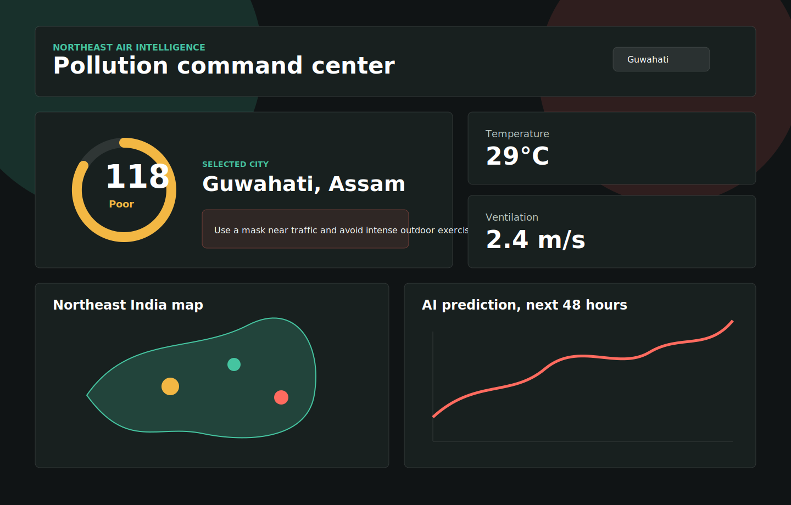

# Northeast India AI Pollution Monitoring Dashboard

Professional full-stack dashboard for live air quality, weather, analytics, alerts, and AI-based AQI prediction across Assam, Meghalaya, Arunachal Pradesh, Nagaland, Manipur, Mizoram, Tripura, and Sikkim.



## What is included

- React + Vite frontend with Tailwind, Recharts, Leaflet maps, Framer Motion, light/dark mode, responsive cards, trends, alerts, chatbot, and PDF report export.
- Node.js + Express REST API with city data, live OpenWeather/AQICN integration hooks, MongoDB persistence, analytics endpoints, and ML proxying.
- Python FastAPI ML service with Random Forest training and 24-48 hour AQI prediction.
- Realistic fallback data so the project runs without API keys.
- Deployment notes for Vercel, Render, MongoDB Atlas, and environment variables.

## Folder Structure

```text
.
|-- client/                 React dashboard
|   |-- src/components/     UI cards, charts, map, alerts, chatbot
|   |-- src/data/           Static city metadata
|   |-- src/hooks/          Data fetching and theme hooks
|   |-- src/lib/            API and utility helpers
|-- server/                 Node + Express API
|   |-- src/config/         Environment and database setup
|   |-- src/controllers/    REST controller logic
|   |-- src/data/           Northeast city seed data
|   |-- src/models/         MongoDB models
|   |-- src/routes/         API routes
|   |-- src/services/       Air quality, weather, analytics, ML services
|-- ml-service/             FastAPI + scikit-learn AQI predictor
|   |-- app/                API and model feature code
|   |-- data/               Synthetic training data generator output
|   |-- model/              Trained model artifact location
|-- docs/screenshots/       UI preview assets
```

## Quick Start

1. Install Node dependencies:

```bash
npm install
```

2. Install Python dependencies:

```bash
cd ml-service
python -m venv .venv
.venv\Scripts\activate
pip install -r requirements.txt
python train_model.py
```

3. Create environment files:

```bash
copy .env.example .env
copy client\.env.example client\.env
copy server\.env.example server\.env
```

4. Start the ML service:

```bash
cd ml-service
uvicorn app.main:app --reload --port 8000
```

5. Start the full web app from the repo root:

```bash
npm run dev
```

Frontend: `http://localhost:5173`

Backend API: `http://localhost:5000/api`

ML service: `http://localhost:8000/docs`

## Live API Integration

The backend supports two live data providers:

- `OPENWEATHER_API_KEY` for weather and pollutant components through OpenWeather.
- `WAQI_TOKEN` for AQICN/WAQI city AQI.

When either key is missing or a provider fails, the API returns seeded Northeast India data with realistic hourly variation. This keeps demos, development, and deployments stable.

## Main API Endpoints

- `GET /api/health`
- `GET /api/cities`
- `GET /api/aqi/live?city=Guwahati`
- `GET /api/analytics/trends?city=Guwahati&range=weekly`
- `GET /api/analytics/comparison`
- `POST /api/predict`
- `POST /api/chat`

## AI/ML Model

The ML service trains a `RandomForestRegressor` using weather, pollutant, lagged AQI, city, and hour features. For a production dataset, replace `ml-service/data/historical_aqi.csv` with CPCB/OpenAQ/OpenWeather historical exports using the same columns:

```text
city,timestamp,temperature,humidity,wind_speed,pm25,pm10,co,no2,so2,aqi
```

Then run:

```bash
python ml-service/train_model.py
```

## AQI Categories

- 0-50: Good
- 51-100: Moderate
- 101-200: Poor
- 201-300: Unhealthy
- 300+: Hazardous

## Deployment

### Frontend on Vercel

1. Set project root to `client`.
2. Build command: `npm run build`.
3. Output directory: `dist`.
4. Add environment variables:
   - `VITE_API_BASE_URL=https://your-render-api.onrender.com/api`
   - `VITE_ML_API_URL=https://your-ml-service.onrender.com`

### Node API on Render

1. Create a Web Service from the repository.
2. Root directory: `server`.
3. Build command: `npm install`.
4. Start command: `npm start`.
5. Add environment variables from `server/.env.example`.

### ML Service on Render

1. Create a Python Web Service.
2. Root directory: `ml-service`.
3. Build command: `pip install -r requirements.txt && python train_model.py`.
4. Start command: `uvicorn app.main:app --host 0.0.0.0 --port $PORT`.

### MongoDB Atlas

Create a free Atlas cluster and set `MONGODB_URI` in the Render API environment. The API still runs without MongoDB, but persistence and historical collection are enabled when it is configured.

## Production Notes

- Use provider-side rate limits and cache live readings for 5-15 minutes.
- Store raw readings, normalized pollutant values, prediction requests, and alert events.
- Add authentication before exposing admin functionality.
- Replace synthetic ML training data with official CPCB, OpenAQ, or provider exports for stronger prediction quality.
